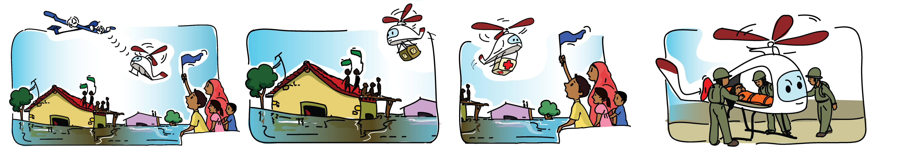

# 
# Theme: Survey & Rescue (SR)

For millennia, humans have been using land and water to navigate terrain.. Air travel has revolutionized many facets of our lives, one amongst which is identifying and providing relief or rescuing fellow humans and their property when their safety is threatened in disasters.

Advances in materials and electronics have led to a boom in portable aerial robots. These can be either user operated or autonomous, with major research going on in enhancing their autonomous capabilities. These robots, called Unmanned Aerial Vehicles(UAVs) can be classified as multirotors, tiltrotors, helicopters, fixed-wing etc.

Quadcopters, a variety of multirotor aircraft are the most ubiquitous amongst these, and in the recent Western India floods of 2019, they have been used with great success, by hobbyists, professional photographers and others to survey and assess the damage to life and property, and helping to coordinate search and rescue operations. Their actions and stories are inspiring and we urge you to look them up on the internet. So, what could be a step-up to these systems? At present, they are limited in range, size and payload. Autonomous light helicopters of course! Manned-light helicopters are widely used in rescue situations, making them autonomous and ubiquitous will surely be a concrete step forward in this regard.

In eYRC 2019-20 we explore an abstracted version of this disaster scenario, using a micro-quadcopter which operates autonomously to perform search and rescue operations. In the process you will learn concepts in control systems, image processing and algorithm development. We have split the competition into a series of Tasks which will help you accomplish the above goal of solving the problem using an autonomous quadcopter.
